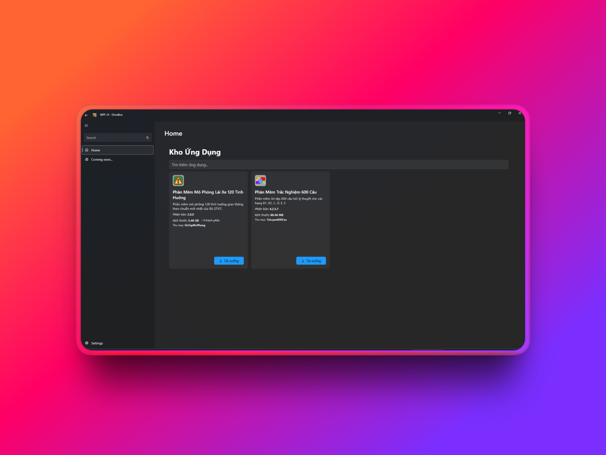
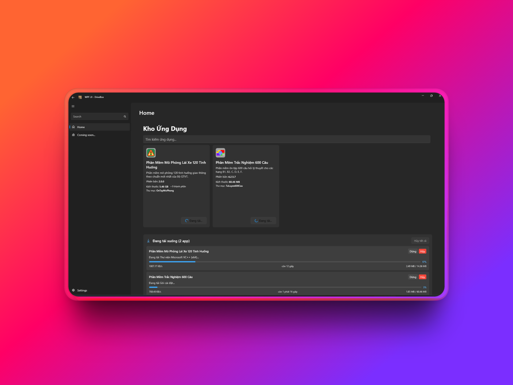
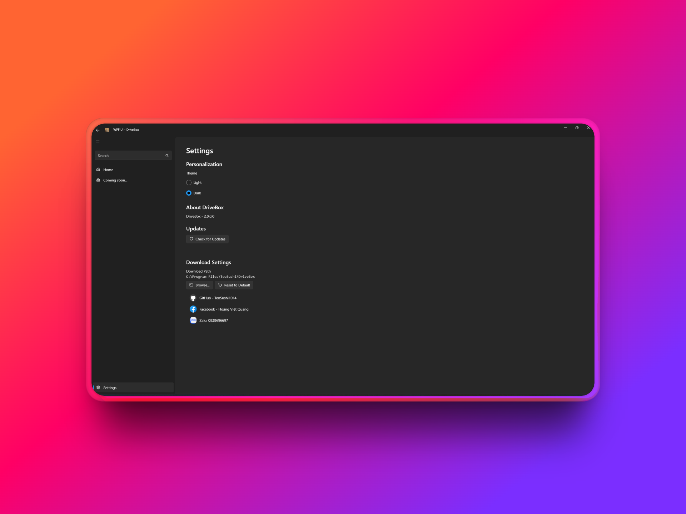
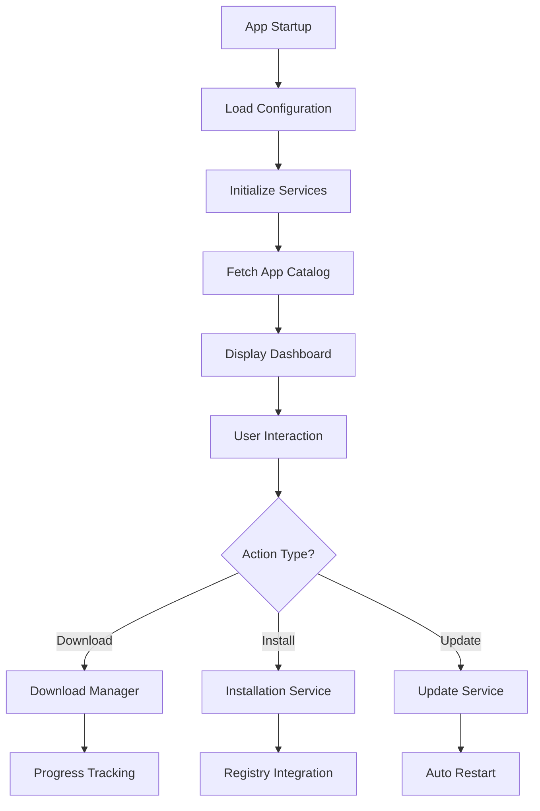
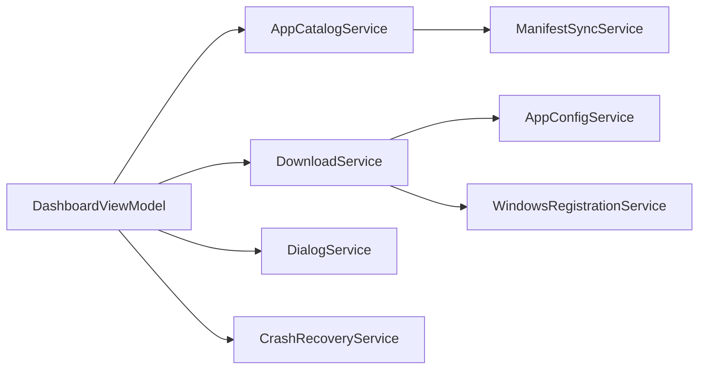

# DriveBox

<div align="center">


**Modern software management and download application for Windows**

[](https://dotnet.microsoft.com/)
[](https://github.com/lepoco/wpfui)
[](https://github.com/TeoSushi1014/drivebox/releases)
[](LICENSE)

[Download](https://github.com/TeoSushi1014/drivebox/releases) • [Documentation](https://github.com/TeoSushi1014/drivebox) • [Issues](https://github.com/TeoSushi1014/drivebox/issues) • [Discussions](https://github.com/TeoSushi1014/drivebox/discussions)

### 🚀 Quick Install
```powershell
irm https://raw.githubusercontent.com/TeoSushi1014/drivebox/main/install.ps1 | iex
```

</div>

---

## Table of Contents

- [Overview](#overview)
- [Features](#features)
- [Screenshots](#screenshots)
- [Installation](#installation)
- [Usage](#usage)
- [Technology Stack](#technology-stack)
- [Architecture](#architecture)
- [Contributing](#contributing)
- [Changelog](#changelog)
- [License](#license)
- [Contact](#contact)

---

## Overview

**DriveBox** is a modern software management application built on .NET 9.0 and WPF. The application provides a user-friendly interface for downloading, installing, and managing driving license training software and other useful tools.

### Goals

- **Simplify** software download and installation process
- **Automate** update and maintenance workflows
- **Ensure** application integrity and security
- **Provide** modern and smooth user experience

---

## Features

### **Smart Application Catalog**
- Automatically updated application catalog
- Fast keyword-based search functionality
- Detailed information display: size, version, description
- Category-based application classification

### **Advanced Download Manager**
- Parallel download of multiple applications
- Pause/resume download capability
- Detailed progress and speed monitoring
- SHA-256 checksum verification
- Automatic retry on failure

### **Application Management**
- Automatic installation status checking
- File integrity verification
- Safe uninstallation process
- Automatic shortcut creation
- Installation directory management

### **Auto-Update System**
- Update checking on startup
- Automatic download and installation
- New version notifications
- Changelog display

### **Security & Stability**
- Digital signature authentication
- Smart caching with compression
- Automatic crash recovery
- Comprehensive logging and error tracking
- Module-based architecture

### **Modern Interface**
- Dark/Light theme support
- Responsive design
- Fluent Design System
- Intuitive navigation
- Customizable settings

---

## Screenshots

### Main Dashboard


### Download Manager  


### Settings


</details>

---

## Installation

### System Requirements

| Component | Minimum Requirement | Recommended |
|-----------|-------------------|-------------|
| **OS** | Windows 10 version 1809+ | Windows 11 22H2+ |
| **Framework** | .NET 9.0 Runtime | .NET 9.0 SDK |
| **RAM** | 512 MB | 1 GB+ |
| **Storage** | 100 MB | 1 GB+ (for cache) |
| **Internet** | Stable connection | Broadband |

### Download Options

#### Option 1: One-Line PowerShell Install (Recommended)
```powershell
# Quick install with PowerShell (Run as Administrator recommended)
irm https://raw.githubusercontent.com/TeoSushi1014/drivebox/main/install.ps1 | iex
```

#### Option 2: GitHub Releases (Traditional)
```bash
# Download the latest installer from GitHub Releases
# Run DriveBox-Setup.exe and follow the installation wizard
```

#### Option 3: Portable
```bash
# Download DriveBox-Portable.zip
# Extract and run DriveBox.exe
```

#### Option 4: Build from Source
```bash
# Clone repository
git clone https://github.com/TeoSushi1014/drivebox.git
cd DriveBox

# Restore dependencies
dotnet restore

# Build project  
dotnet build --configuration Release

# Run application
dotnet run --project DriveBox.csproj
```

### Advanced PowerShell Installation Options

```powershell
# Install to custom directory
irm https://raw.githubusercontent.com/TeoSushi1014/drivebox/main/install.ps1 | iex -InstallPath "C:\MyApps\DriveBox"

# Silent installation (no interaction, no auto-launch)
irm https://raw.githubusercontent.com/TeoSushi1014/drivebox/main/install.ps1 | iex -Silent

# Force reinstall over existing version
irm https://raw.githubusercontent.com/TeoSushi1014/drivebox/main/install.ps1 | iex -Force

# Install without creating desktop shortcut
irm https://raw.githubusercontent.com/TeoSushi1014/drivebox/main/install.ps1 | iex -CreateShortcut:$false

# Install without auto-launching the application
irm https://raw.githubusercontent.com/TeoSushi1014/drivebox/main/install.ps1 | iex -NoLaunch
```

### Uninstall DriveBox

```powershell
# Uninstall DriveBox completely
irm https://raw.githubusercontent.com/TeoSushi1014/drivebox/main/uninstall.ps1 | iex
```

### Quick Start

1. **Install** DriveBox using the one-line PowerShell command above
2. **DriveBox will automatically launch** after installation completes
3. **Wait** for the application to load the software catalog
4. **Select** the application you want to install
5. **Click** the "Download" button 
6. **Monitor** progress in the Download Manager

---

## Usage

### Browse and Search Applications

```
1. Open DriveBox
2. Browse the application list on the Dashboard
3. Use the search bar to find specific applications
4. View detailed information: description, version, size
```

### Download and Install

```
1. Click the "Download" button on the desired application
2. Monitor progress in the Download Manager panel
3. Application will automatically install after download completion
4. Use the "Open" button to launch the application
```

### Manage Installed Applications

```
1. Installed applications will show "Installed ✓" status
2. Click "Verify" to check file integrity
3. Click "Uninstall" to remove the application
4. Right-click to access context menu with additional options
```

### Configuration

```
1. Access Settings from the left menu
2. Change download directory path
3. Select Dark/Light theme  
4. Configure automatic updates
5. Set concurrent download limits
```

---

## Technology Stack

### **Backend Framework**
-  **.NET 9.0** - Core runtime platform
-  **C# 11** - Programming language

### **Frontend Framework**  
-  **Windows Presentation Foundation** - UI framework
-  **WPF-UI 4.0.2** - Modern UI controls

### **Architecture Patterns**
-  **MVVM Pattern** - Separation of concerns
-  **Microsoft.Extensions.DI** - Service container
-  **Microsoft.Extensions.Hosting** - Application lifecycle

### **Key Libraries**
- **CommunityToolkit.Mvvm 8.4.0** - MVVM helpers and code generation
- **System.Net.Http** - HTTP client for downloads
- **System.Text.Json** - JSON serialization
- **System.IO.Compression** - File compression
- **System.Security.Cryptography** - SHA-256 verification

### **Data Management**
- **JSON** - Configuration and manifest storage  
- **Local Files** - Caching and persistent data
- **HTTP REST** - Remote manifest fetching
- **File System** - Application installation management

### **Installation & Distribution**
- **PowerShell One-Liner** - Modern installation method like `irm install.ps1 | iex`
- **GitHub Releases API** - Automatic latest version detection
- **Progress Tracking** - Real-time download and installation feedback
- **Dependency Checking** - .NET 9.0 Desktop Runtime verification
- **PATH Integration** - Automatic system PATH registration

---

## Architecture

### Project Structure

```
DriveBox/
├── Assets/                 # Icons, images, resources
├── Helpers/                # Utility classes & converters  
├── Models/                 # Data models & entities
│   ├── AppInfo.cs          # Application information model
│   ├── AppConfig.cs        # Configuration model
│   └── Download/           # Download-related models
├── Services/               # Business logic & services
│   ├── AppCatalogService.cs         # App catalog management
│   ├── DownloadService.cs           # Download operations  
│   ├── UpdateService.cs             # Auto-update logic
│   └── WindowsRegistrationService.cs # Windows integration
├── ViewModels/             # MVVM view models
│   ├── Pages/              # Page view models
│   └── Windows/            # Window view models  
├── Views/                  # UI components
│   ├── Pages/              # Application pages
│   ├── Windows/            # Application windows
│   └── Controls/           # Custom user controls
└── App.xaml.cs            # Application entry point
```

### Data Flow



### Service Dependencies



---

## Contributing

We welcome all contributions from the community!

### Getting Started

1. **Fork** this repository
2. **Clone** your fork to your local machine
3. **Create** a new branch for your feature/bugfix
4. **Commit** your changes
5. **Push** the branch to GitHub  
6. **Create** a Pull Request

### Contribution Guidelines

- **Code Style**: Follow C# coding conventions
- **Testing**: Add unit tests for new code
- **Documentation**: Update documentation when necessary
- **Commit Messages**: Use conventional commits
- **Branch Naming**: `feature/feature-name` or `bugfix/bug-description`

### Bug Reports

Use [GitHub Issues](https://github.com/TeoSushi1014/drivebox/issues) with this template:

```markdown
**Bug Description**
A clear and concise description of the bug

**Steps to Reproduce**
1. Go to '...'
2. Click on '....'
3. Scroll down to '....'
4. See error

**Expected Behavior**  
Describe what you expected to happen

**Screenshots**
If applicable, add screenshots to help explain the problem

**Environment:**
 - OS: [e.g. Windows 11]
 - Version: [e.g. 2.0.0]
 - .NET Version: [e.g. 9.0]
```

### Feature Requests

Create a [Feature Request](https://github.com/TeoSushi1014/drivebox/issues) with the `enhancement` label

---

## Changelog

### Version 2.0.0 (Latest)
- **New**: Modern WPF-UI interface
- **New**: Smart download manager with pause/resume functionality  
- **New**: Auto-update mechanism
- **New**: Application verification system
- **New**: Crash recovery & error handling
- **Improved**: Performance optimizations
- **Improved**: Better error messages
- **Fixed**: Memory leaks in download process
- **Fixed**: UI freezing issues

<details>
<summary><strong>View complete changelog</strong></summary>

### Version 1.x.x
- Initial release with basic functionality
- Simple app catalog
- Basic download capability

</details>

---

## License

This project is distributed under the **MIT License**. See the [LICENSE](LICENSE) file for more details.

```
MIT License

Copyright (c) 2025 Hoang Viet Quang (TeoSushi1014)

Permission is hereby granted, free of charge, to any person obtaining a copy
of this software and associated documentation files (the "Software"), to deal
in the Software without restriction, including without limitation the rights
to use, copy, modify, merge, publish, distribute, sublicense, and/or sell
copies of the Software, and to permit persons to whom the Software is
furnished to do so, subject to the following conditions:

The above copyright notice and this permission notice shall be included in all
copies or substantial portions of the Software.

THE SOFTWARE IS PROVIDED "AS IS", WITHOUT WARRANTY OF ANY KIND, EXPRESS OR
IMPLIED, INCLUDING BUT NOT LIMITED TO THE WARRANTIES OF MERCHANTABILITY,
FITNESS FOR A PARTICULAR PURPOSE AND NONINFRINGEMENT. IN NO EVENT SHALL THE
AUTHORS OR COPYRIGHT HOLDERS BE LIABLE FOR ANY CLAIM, DAMAGES OR OTHER
LIABILITY, WHETHER IN AN ACTION OF CONTRACT, TORT OR OTHERWISE, ARISING FROM,
OUT OF OR IN CONNECTION WITH THE SOFTWARE OR THE USE OR OTHER DEALINGS IN THE
SOFTWARE.
```

---

## Contact

<div align="center">

### Connect with Me

[](https://github.com/TeoSushi1014)
[](https://www.facebook.com/teosushi1014z/)
[](http://zaloapp.com/qr/p/1199v1m69pbiq)

### Support & Feedback

- **Email**: teosushi1014@gmail.com  
- **Discussions**: [GitHub Discussions](https://github.com/TeoSushi1014/drivebox/discussions)
- **Bug Reports**: [GitHub Issues](https://github.com/TeoSushi1014/drivebox/issues)
- **Documentation**: [Wiki](https://github.com/TeoSushi1014/drivebox)

---

<sub>Made with love by the Hoang Viet Quang (TeoSushi1014) | © 2025 All rights reserved</sub>

**If this project is helpful, don't forget to star the repository!**

</div>